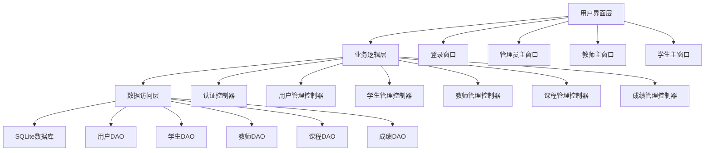
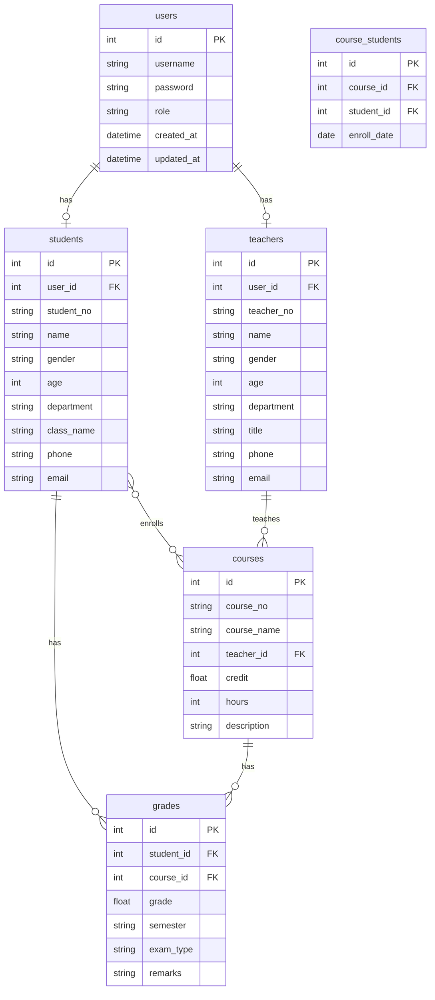
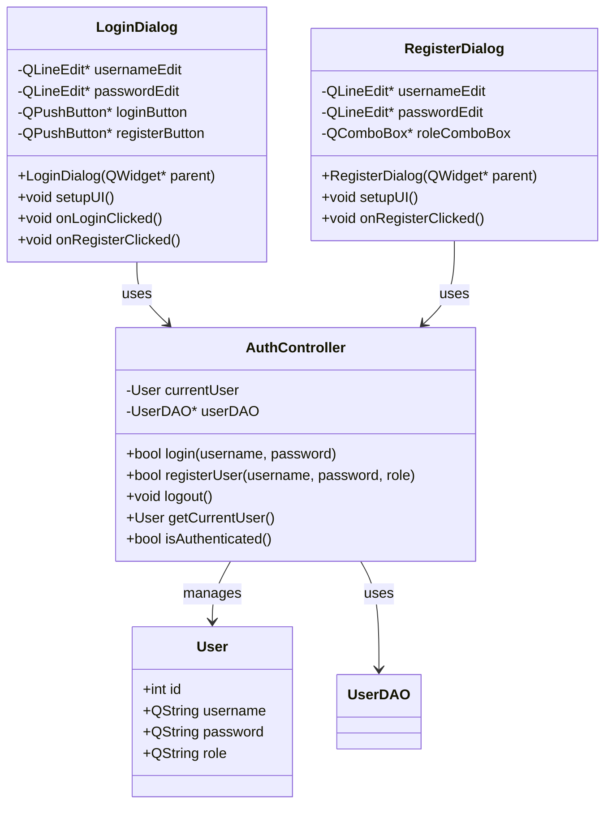
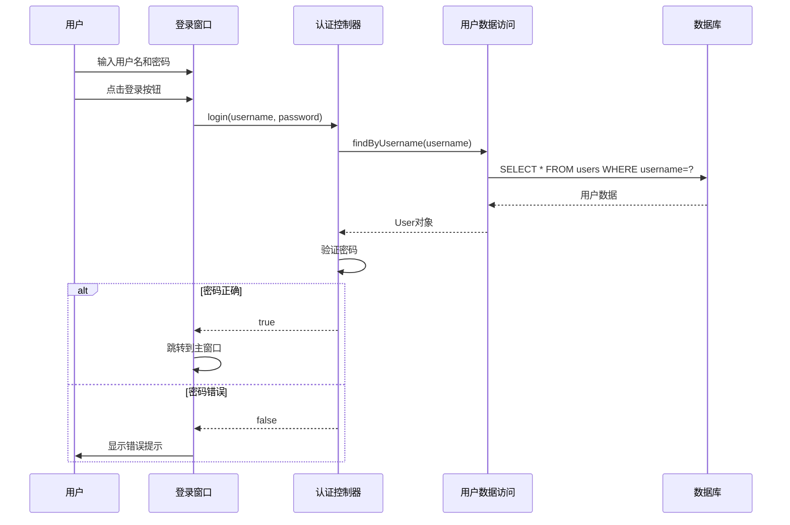
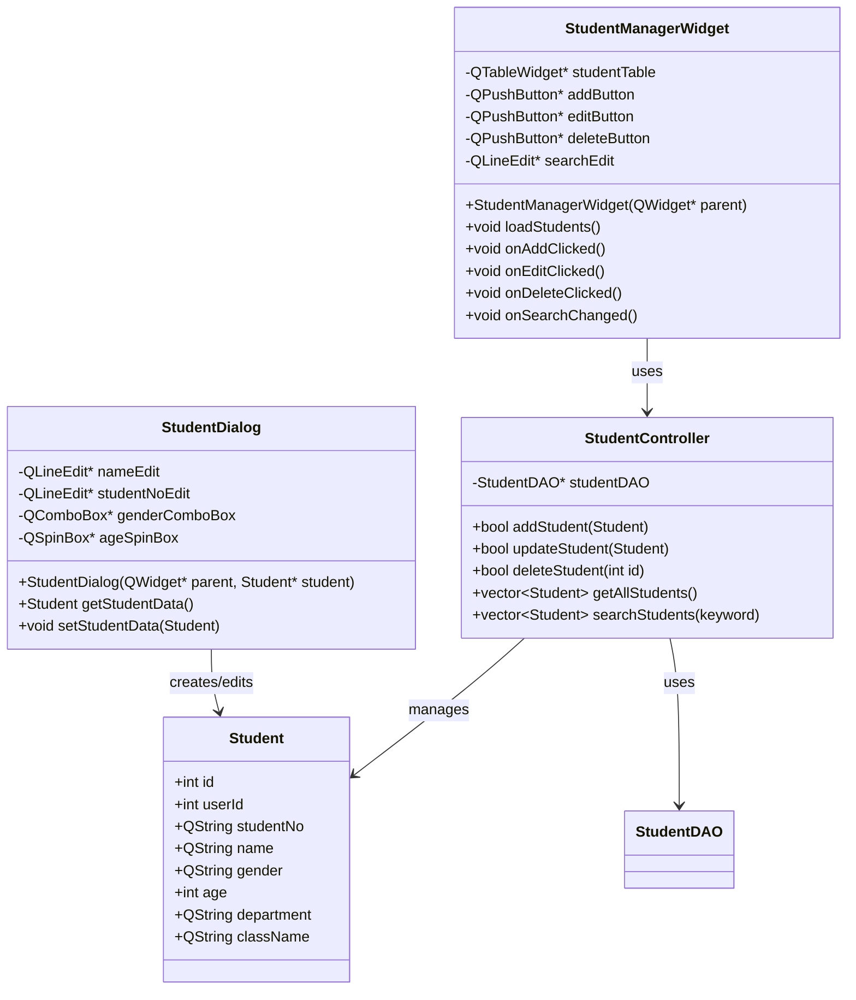
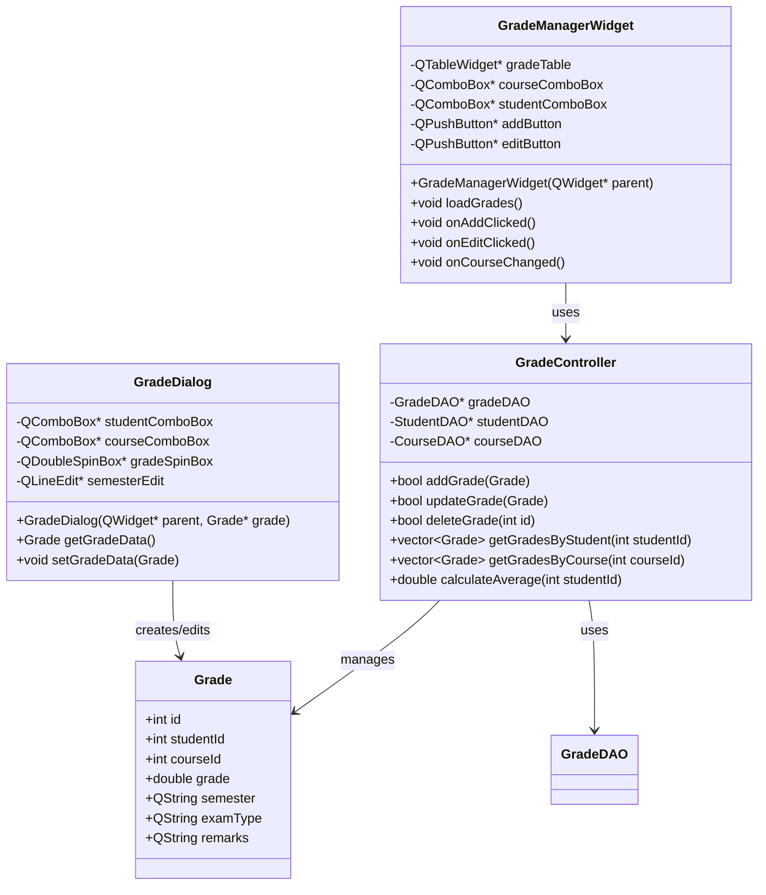
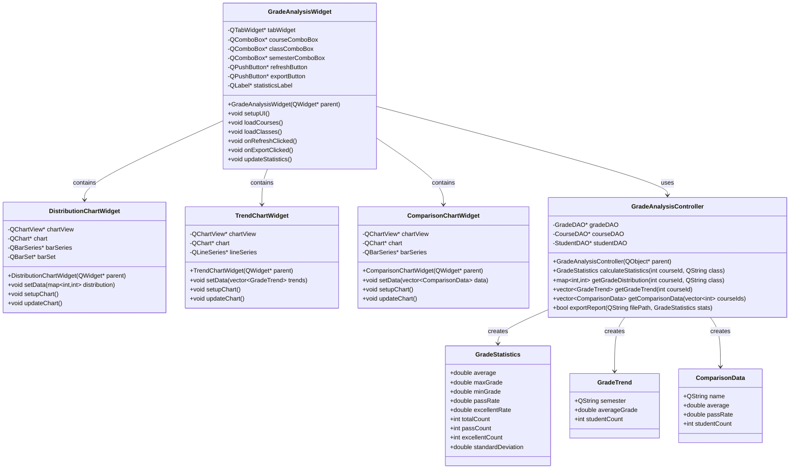
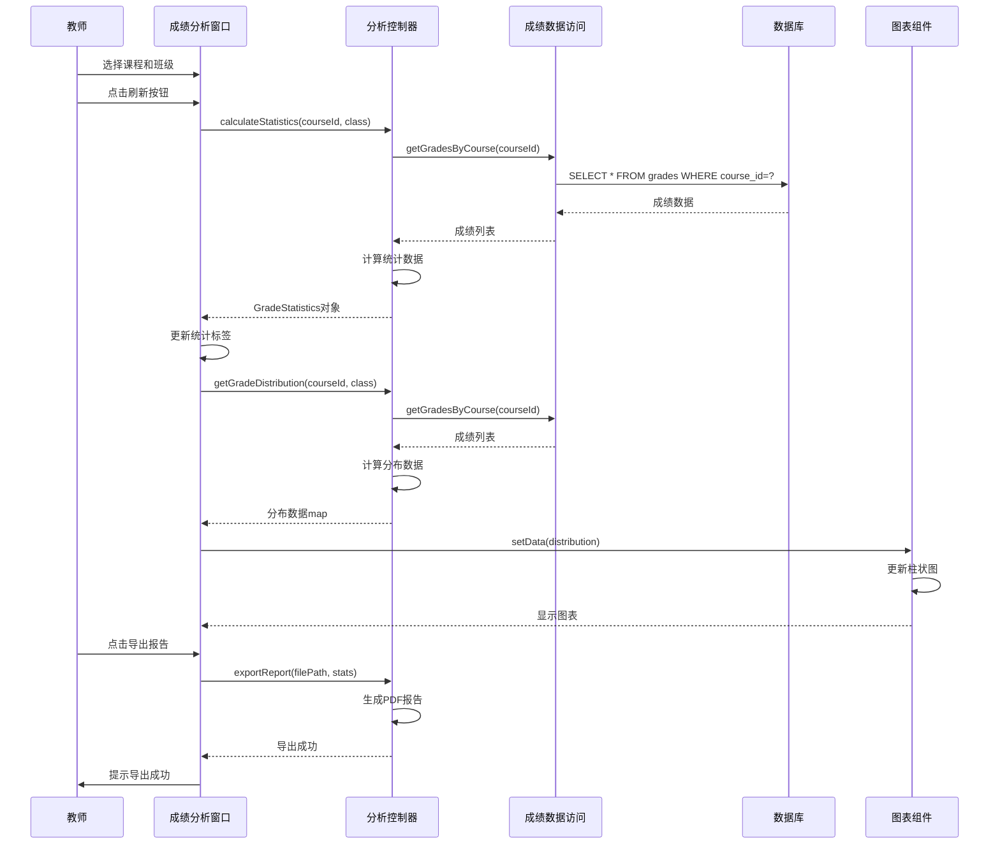

# 学生管理系统技术设计文档

## 文档信息
- **项目名称**: 学生管理系统
- **版本**: v1.0
- **创建日期**: 2026-03-04
- **最后更新**: 2026-03-04

## 1. 设计概述

### 1.1 设计目标
本系统采用Qt框架开发跨平台桌面应用程序，实现学生、教师、课程和成绩的信息化管理。设计目标包括：
- **模块化设计**：采用分层架构，实现高内聚低耦合
- **可扩展性**：预留扩展接口，便于功能扩展
- **安全性**：实现基于角色的访问控制和数据加密
- **易维护性**：清晰的代码结构和完善的文档
- **跨平台**：支持Windows、Linux、macOS多平台运行

### 1.2 技术栈
| 技术类别 | 技术选型 | 版本要求 |
|---------|---------|---------|
| 开发框架 | Qt Framework | 5.12+ |
| 编程语言 | C++ | C++17 |
| 数据库 | SQLite | 3.x |
| 图表库 | Qt Charts | 5.12+ |
| IDE | Qt Creator | 4.x+ |
| 构建工具 | qmake/CMake | - |
| UI设计 | Qt Designer | - |
| 版本控制 | Git | - |

### 1.3 系统架构图
```
┌─────────────────────────────────────────────────────────┐
│                    表示层 (UI Layer)                     │
│  ┌──────────┐  ┌──────────┐  ┌──────────┐  ┌──────────┐ │
│  │登录窗口  │  │管理员窗口│  │教师窗口  │  │学生窗口  │ │
│  └──────────┘  └──────────┘  └──────────┘  └──────────┘ │
└─────────────────────────────────────────────────────────┘
                            ↓
┌─────────────────────────────────────────────────────────┐
│                  业务逻辑层 (Business Layer)              │
│  ┌──────────┐  ┌──────────┐  ┌──────────┐  ┌──────────┐ │
│  │用户管理  │  │学生管理  │  │教师管理  │  │课程管理  │ │
│  │控制器    │  │控制器    │  │控制器    │  │控制器    │ │
│  └──────────┘  └──────────┘  └──────────┘  └──────────┘ │
│  ┌──────────┐  ┌──────────┐  ┌──────────┐               │
│  │成绩管理  │  │权限管理  │  │数据验证  │               │
│  │控制器    │  │控制器    │  │器        │               │
│  └──────────┘  └──────────┘  └──────────┘               │
│  ┌──────────┐                                            │
│  │成绩分析  │                                            │
│  │控制器    │                                            │
│  └──────────┘                                            │
└─────────────────────────────────────────────────────────┘
                            ↓
┌─────────────────────────────────────────────────────────┐
│                数据访问层 (Data Access Layer)             │
│  ┌──────────┐  ┌──────────┐  ┌──────────┐  ┌──────────┐ │
│  │用户DAO   │  │学生DAO   │  │教师DAO   │  │课程DAO   │ │
│  └──────────┘  └──────────┘  └──────────┘  └──────────┘ │
│  ┌──────────┐  ┌──────────┐                               │
│  │成绩DAO   │  │数据库管理│                               │
│  └──────────┘  └──────────┘                               │
└─────────────────────────────────────────────────────────┘
                            ↓
┌─────────────────────────────────────────────────────────┐
│                  数据层 (Data Layer)                      │
│                    SQLite 数据库                          │
│  ┌──────────┐  ┌──────────┐  ┌──────────┐  ┌──────────┐ │
│  │users表   │  │students表│  │teachers表│  │courses表 │ │
│  └──────────┘  └──────────┘  └──────────┘  └──────────┘ │
│  ┌──────────┐  ┌──────────┐                               │
│  │grades表  │  │course_stu│                               │
│  └──────────┘  └──────────┘                               │
└─────────────────────────────────────────────────────────┘
```

## 2. 系统架构

### 2.1 整体架构
系统采用经典的三层架构设计：
- **表示层**：负责用户界面展示和用户交互，使用Qt Widgets实现
- **业务逻辑层**：处理核心业务逻辑，包括数据验证、权限控制、业务规则
- **数据访问层**：封装数据库操作，提供统一的数据访问接口

### 2.2 模块划分
| 模块名称 | 职责描述 | 主要类 |
|---------|---------|--------|
| 认证模块 | 用户登录、注册、会话管理 | LoginDialog, RegisterDialog, AuthController |
| 用户管理模块 | 用户信息管理 | UserManager, UserController |
| 学生管理模块 | 学生信息CRUD操作 | StudentManager, StudentController |
| 教师管理模块 | 教师信息CRUD操作 | TeacherManager, TeacherController |
| 课程管理模块 | 课程信息管理 | CourseManager, CourseController |
| 成绩管理模块 | 成绩录入和查询 | GradeManager, GradeController |
| 成绩分析模块 | 成绩数据统计和可视化 | GradeAnalysisWidget, GradeAnalysisController, ChartWidget |
| 权限管理模块 | RBAC权限控制 | PermissionManager, RoleManager |
| 数据库模块 | 数据库连接和操作 | DatabaseManager, BaseDAO |

### 2.3 架构图


## 3. 数据模型

### 3.1 数据库设计

#### 3.1.1 用户表 (users)
```sql
CREATE TABLE users (
    id INTEGER PRIMARY KEY AUTOINCREMENT,
    username VARCHAR(50) UNIQUE NOT NULL,
    password VARCHAR(255) NOT NULL,
    role VARCHAR(20) NOT NULL CHECK(role IN ('admin', 'teacher', 'student')),
    created_at DATETIME DEFAULT CURRENT_TIMESTAMP,
    updated_at DATETIME DEFAULT CURRENT_TIMESTAMP
);
```

#### 3.1.2 学生表 (students)
```sql
CREATE TABLE students (
    id INTEGER PRIMARY KEY AUTOINCREMENT,
    user_id INTEGER UNIQUE,
    student_no VARCHAR(20) UNIQUE NOT NULL,
    name VARCHAR(50) NOT NULL,
    gender VARCHAR(10) CHECK(gender IN ('男', '女')),
    age INTEGER,
    department VARCHAR(100),
    class_name VARCHAR(50),
    phone VARCHAR(20),
    email VARCHAR(100),
    created_at DATETIME DEFAULT CURRENT_TIMESTAMP,
    updated_at DATETIME DEFAULT CURRENT_TIMESTAMP,
    FOREIGN KEY (user_id) REFERENCES users(id) ON DELETE CASCADE
);
```

#### 3.1.3 教师表 (teachers)
```sql
CREATE TABLE teachers (
    id INTEGER PRIMARY KEY AUTOINCREMENT,
    user_id INTEGER UNIQUE,
    teacher_no VARCHAR(20) UNIQUE NOT NULL,
    name VARCHAR(50) NOT NULL,
    gender VARCHAR(10) CHECK(gender IN ('男', '女')),
    age INTEGER,
    department VARCHAR(100),
    title VARCHAR(50),
    phone VARCHAR(20),
    email VARCHAR(100),
    created_at DATETIME DEFAULT CURRENT_TIMESTAMP,
    updated_at DATETIME DEFAULT CURRENT_TIMESTAMP,
    FOREIGN KEY (user_id) REFERENCES users(id) ON DELETE CASCADE
);
```

#### 3.1.4 课程表 (courses)
```sql
CREATE TABLE courses (
    id INTEGER PRIMARY KEY AUTOINCREMENT,
    course_no VARCHAR(20) UNIQUE NOT NULL,
    course_name VARCHAR(100) NOT NULL,
    teacher_id INTEGER,
    credit REAL,
    hours INTEGER,
    description TEXT,
    created_at DATETIME DEFAULT CURRENT_TIMESTAMP,
    updated_at DATETIME DEFAULT CURRENT_TIMESTAMP,
    FOREIGN KEY (teacher_id) REFERENCES teachers(id) ON DELETE SET NULL
);
```

#### 3.1.5 成绩表 (grades)
```sql
CREATE TABLE grades (
    id INTEGER PRIMARY KEY AUTOINCREMENT,
    student_id INTEGER NOT NULL,
    course_id INTEGER NOT NULL,
    grade REAL CHECK(grade >= 0 AND grade <= 100),
    semester VARCHAR(20),
    exam_type VARCHAR(50),
    remarks TEXT,
    created_at DATETIME DEFAULT CURRENT_TIMESTAMP,
    updated_at DATETIME DEFAULT CURRENT_TIMESTAMP,
    FOREIGN KEY (student_id) REFERENCES students(id) ON DELETE CASCADE,
    FOREIGN KEY (course_id) REFERENCES courses(id) ON DELETE CASCADE,
    UNIQUE(student_id, course_id, semester)
);
```

#### 3.1.6 课程学生关联表 (course_students)
```sql
CREATE TABLE course_students (
    id INTEGER PRIMARY KEY AUTOINCREMENT,
    course_id INTEGER NOT NULL,
    student_id INTEGER NOT NULL,
    enroll_date DATE,
    created_at DATETIME DEFAULT CURRENT_TIMESTAMP,
    FOREIGN KEY (course_id) REFERENCES courses(id) ON DELETE CASCADE,
    FOREIGN KEY (student_id) REFERENCES students(id) ON DELETE CASCADE,
    UNIQUE(course_id, student_id)
);
```

### 3.2 数据关系图


### 3.3 数据字典

#### 用户表字段说明
| 字段名 | 数据类型 | 长度 | 必填 | 说明 |
|--------|---------|------|------|------|
| id | INTEGER | - | 是 | 主键，自增 |
| username | VARCHAR | 50 | 是 | 用户名，唯一 |
| password | VARCHAR | 255 | 是 | 密码（加密存储） |
| role | VARCHAR | 20 | 是 | 角色：admin/teacher/student |
| created_at | DATETIME | - | - | 创建时间 |
| updated_at | DATETIME | - | - | 更新时间 |

#### 学生表字段说明
| 字段名 | 数据类型 | 长度 | 必填 | 说明 |
|--------|---------|------|------|------|
| id | INTEGER | - | 是 | 主键，自增 |
| user_id | INTEGER | - | - | 关联用户ID |
| student_no | VARCHAR | 20 | 是 | 学号，唯一 |
| name | VARCHAR | 50 | 是 | 姓名 |
| gender | VARCHAR | 10 | - | 性别：男/女 |
| age | INTEGER | - | - | 年龄 |
| department | VARCHAR | 100 | - | 院系 |
| class_name | VARCHAR | 50 | - | 班级 |
| phone | VARCHAR | 20 | - | 联系电话 |
| email | VARCHAR | 100 | - | 电子邮箱 |

## 4. 接口设计

### 4.1 核心类接口

#### 4.1.1 数据访问接口 (BaseDAO)
```cpp
template<typename T>
class BaseDAO {
public:
    virtual ~BaseDAO() = default;

    // 插入记录
    virtual bool insert(const T& entity) = 0;

    // 更新记录
    virtual bool update(const T& entity) = 0;

    // 删除记录
    virtual bool remove(int id) = 0;

    // 根据ID查询
    virtual std::optional<T> findById(int id) = 0;

    // 查询所有记录
    virtual std::vector<T> findAll() = 0;

    // 分页查询
    virtual std::vector<T> findByPage(int page, int pageSize) = 0;

    // 统计记录数
    virtual int count() = 0;
};
```

#### 4.1.2 用户管理接口 (UserDAO)
```cpp
class UserDAO : public BaseDAO<User> {
public:
    // 根据用户名查询
    std::optional<User> findByUsername(const QString& username);

    // 验证用户登录
    bool validateLogin(const QString& username, const QString& password);

    // 根据角色查询用户
    std::vector<User> findByRole(const QString& role);

    // 修改密码
    bool changePassword(int userId, const QString& newPassword);
};
```

#### 4.1.3 学生管理接口 (StudentDAO)
```cpp
class StudentDAO : public BaseDAO<Student> {
public:
    // 根据学号查询
    std::optional<Student> findByStudentNo(const QString& studentNo);

    // 根据班级查询
    std::vector<Student> findByClass(const QString& className);

    // 根据院系查询
    std::vector<Student> findByDepartment(const QString& department);

    // 模糊搜索
    std::vector<Student> search(const QString& keyword);
};
```

#### 4.1.4 成绩管理接口 (GradeDAO)
```cpp
class GradeDAO : public BaseDAO<Grade> {
public:
    // 根据学生ID查询成绩
    std::vector<Grade> findByStudentId(int studentId);

    // 根据课程ID查询成绩
    std::vector<Grade> findByCourseId(int courseId);

    // 查询学生某门课程的成绩
    std::optional<Grade> findByStudentAndCourse(int studentId, int courseId);

    // 统计课程平均分
    double calculateCourseAverage(int courseId);

    // 统计学生平均分
    double calculateStudentAverage(int studentId);
};
```

### 4.2 控制器接口

#### 4.2.1 认证控制器 (AuthController)
```cpp
class AuthController : public QObject {
    Q_OBJECT
public:
    explicit AuthController(QObject* parent = nullptr);

    // 用户登录
    bool login(const QString& username, const QString& password);

    // 用户注册
    bool registerUser(const QString& username, const QString& password,
                      const QString& role);

    // 用户登出
    void logout();

    // 获取当前用户
    User getCurrentUser() const;

    // 检查是否已登录
    bool isAuthenticated() const;

signals:
    void loginSuccess(const User& user);
    void loginFailed(const QString& message);
    void logoutSuccess();
};
```

#### 4.2.2 权限控制器 (PermissionController)
```cpp
class PermissionController {
public:
    // 检查权限
    bool hasPermission(const User& user, const QString& permission);

    // 检查角色
    bool hasRole(const User& user, const QString& role);

    // 获取角色权限列表
    QStringList getRolePermissions(const QString& role);

private:
    QMap<QString, QStringList> rolePermissions;
};
```

## 5. 模块设计

### 5.1 认证模块

#### 5.1.1 功能描述
负责用户身份认证，包括登录、注册、会话管理等功能。

#### 5.1.2 类图


#### 5.1.3 时序图


### 5.2 学生管理模块

#### 5.2.1 功能描述
管理学生信息的增删改查操作，支持按条件查询和分页显示。

#### 5.2.2 类图


### 5.3 成绩管理模块

#### 5.3.1 功能描述
管理学生成绩的录入、查询和统计功能。

#### 5.3.2 类图


### 5.4 成绩分析模块

#### 5.4.1 功能描述
提供成绩数据的统计分析和可视化展示功能，包括成绩分布、趋势分析、对比分析等，使用Qt Charts库实现图表展示。

#### 5.4.2 类图


#### 5.4.3 时序图


#### 5.4.4 界面设计
```
┌─────────────────────────────────────────────────────────────┐
│  成绩分析                                    [刷新] [导出]   │
├─────────────────────────────────────────────────────────────┤
│  课程: [下拉选择]  班级: [下拉选择]  学期: [下拉选择]        │
├─────────────────────────────────────────────────────────────┤
│  统计数据                                                    │
│  ┌──────────────────────────────────────────────────────┐  │
│  │ 平均分: 78.5   最高分: 98   最低分: 45                │  │
│  │ 及格率: 85.2%  优秀率: 32.1%  总人数: 112            │  │
│  │ 标准差: 12.3   及格人数: 95   优秀人数: 36           │  │
│  └──────────────────────────────────────────────────────┘  │
├─────────────────────────────────────────────────────────────┤
│  [成绩分布] [成绩趋势] [成绩对比]                            │
│  ┌──────────────────────────────────────────────────────┐  │
│  │                                                       │  │
│  │              成绩分布柱状图                           │  │
│  │         ┌──┐                                         │  │
│  │         │  │    ┌──┐                                 │  │
│  │    ┌──┐ │  │    │  │    ┌──┐                        │  │
│  │    │  │ │  │    │  │    │  │    ┌──┐               │  │
│  │ ┌──┤  ├─┤  ├────┤  ├────┤  ├────┤  ├──┐            │  │
│  │ │  │  │ │  │    │  │    │  │    │  │  │            │  │
│  │ └──┴──┴─┴──┴────┴──┴────┴──┴────┴──┴──┘            │  │
│  │  0-59 60-69 70-79 80-89 90-100                      │  │
│  └──────────────────────────────────────────────────────┘  │
└─────────────────────────────────────────────────────────────┘
```

#### 5.4.5 核心接口设计
```cpp
// 成绩分析控制器接口
class GradeAnalysisController : public QObject {
    Q_OBJECT
public:
    explicit GradeAnalysisController(QObject* parent = nullptr);

    // 计算统计数据
    GradeStatistics calculateStatistics(int courseId,
                                       const QString& className = "",
                                       const QString& semester = "");

    // 获取成绩分布（分数段 -> 人数）
    QMap<int, int> getGradeDistribution(int courseId,
                                        const QString& className = "",
                                        const QString& semester = "");

    // 获取成绩趋势（历次考试平均分）
    QVector<GradeTrend> getGradeTrend(int courseId);

    // 获取对比数据（多个班级或课程对比）
    QVector<ComparisonData> getComparisonData(const QVector<int>& courseIds,
                                              const QString& semester = "");

    // 导出分析报告
    bool exportReport(const QString& filePath,
                     const GradeStatistics& stats,
                     const QMap<int, int>& distribution);

signals:
    void statisticsUpdated(const GradeStatistics& stats);
    void chartDataReady(const QMap<int, int>& distribution);
    void exportCompleted(bool success, const QString& message);
};

// 统计数据结构
struct GradeStatistics {
    double average;           // 平均分
    double maxGrade;          // 最高分
    double minGrade;          // 最低分
    double passRate;          // 及格率（>=60）
    double excellentRate;     // 优秀率（>=90）
    int totalCount;           // 总人数
    int passCount;            // 及格人数
    int excellentCount;       // 优秀人数
    double standardDeviation; // 标准差

    // 计算方法
    void calculate(const QVector<double>& grades) {
        if (grades.isEmpty()) return;

        totalCount = grades.size();
        average = std::accumulate(grades.begin(), grades.end(), 0.0) / totalCount;
        maxGrade = *std::max_element(grades.begin(), grades.end());
        minGrade = *std::min_element(grades.begin(), grades.end());

        passCount = std::count_if(grades.begin(), grades.end(),
                                 [](double g) { return g >= 60.0; });
        excellentCount = std::count_if(grades.begin(), grades.end(),
                                      [](double g) { return g >= 90.0; });

        passRate = (double)passCount / totalCount * 100.0;
        excellentRate = (double)excellentCount / totalCount * 100.0;

        // 计算标准差
        double variance = 0.0;
        for (double grade : grades) {
            variance += pow(grade - average, 2);
        }
        standardDeviation = sqrt(variance / totalCount);
    }
};

// 成绩分布图表组件
class DistributionChartWidget : public QWidget {
    Q_OBJECT
public:
    explicit DistributionChartWidget(QWidget* parent = nullptr);

    void setData(const QMap<int, int>& distribution);
    void setTitle(const QString& title);

private:
    void setupChart();
    void updateChart();

    QChartView* m_chartView;
    QChart* m_chart;
    QBarSeries* m_series;
    QBarSet* m_barSet;
    QStringList m_categories;
};

// 成绩趋势图表组件
class TrendChartWidget : public QWidget {
    Q_OBJECT
public:
    explicit TrendChartWidget(QWidget* parent = nullptr);

    void setData(const QVector<GradeTrend>& trends);
    void setTitle(const QString& title);

private:
    void setupChart();
    void updateChart();

    QChartView* m_chartView;
    QChart* m_chart;
    QLineSeries* m_series;
    QValueAxis* m_axisX;
    QValueAxis* m_axisY;
};

// 成绩对比图表组件
class ComparisonChartWidget : public QWidget {
    Q_OBJECT
public:
    explicit ComparisonChartWidget(QWidget* parent = nullptr);

    void setData(const QVector<ComparisonData>& data);
    void setTitle(const QString& title);

private:
    void setupChart();
    void updateChart();

    QChartView* m_chartView;
    QChart* m_chart;
    QBarSeries* m_series;
    QVector<QBarSet*> m_barSets;
};
```

## 6. 安全设计

### 6.1 认证机制
- **密码加密**：使用SHA-256算法对密码进行加盐哈希存储
- **会话管理**：使用单例模式管理当前用户会话
- **登录限制**：连续登录失败5次后锁定账号15分钟

```cpp
class PasswordHasher {
public:
    static QString hashPassword(const QString& password, const QString& salt) {
        QByteArray data = (password + salt).toUtf8();
        QByteArray hash = QCryptographicHash::hash(data, QCryptographicHash::Sha256);
        return hash.toHex();
    }

    static QString generateSalt() {
        return QUuid::createUuid().toString(QUuid::WithoutBraces);
    }

    static bool verifyPassword(const QString& password,
                               const QString& salt,
                               const QString& hash) {
        return hashPassword(password, salt) == hash;
    }
};
```

### 6.2 权限控制
采用RBAC（基于角色的访问控制）模型：

| 角色 | 权限列表 |
|------|---------|
| admin | user:read, user:write, student:read, student:write, teacher:read, teacher:write, course:read, course:write, grade:read, grade:write |
| teacher | student:read, course:read, course:write, grade:read, grade:write |
| student | profile:read, profile:write, grade:read |

```cpp
class PermissionManager {
private:
    QMap<QString, QStringList> rolePermissions = {
        {"admin", {"user:read", "user:write", "student:read", "student:write",
                   "teacher:read", "teacher:write", "course:read", "course:write",
                   "grade:read", "grade:write"}},
        {"teacher", {"student:read", "course:read", "course:write",
                     "grade:read", "grade:write"}},
        {"student", {"profile:read", "profile:write", "grade:read"}}
    };

public:
    bool hasPermission(const QString& role, const QString& permission) {
        return rolePermissions[role].contains(permission);
    }
};
```

### 6.3 数据安全
- **SQL注入防护**：使用参数化查询，禁止字符串拼接SQL
- **输入验证**：对所有用户输入进行验证和过滤
- **数据备份**：提供数据库备份和恢复功能

```cpp
// 使用参数化查询防止SQL注入
QSqlQuery query;
query.prepare("SELECT * FROM users WHERE username = :username AND password = :password");
query.bindValue(":username", username);
query.bindValue(":password", passwordHash);
query.exec();
```

## 7. 性能设计

### 7.1 性能指标
| 指标项 | 目标值 | 测试方法 |
|--------|--------|---------|
| 登录响应时间 | ≤ 2秒 | 模拟100次登录取平均值 |
| 数据查询时间 | ≤ 3秒 | 查询1000条记录 |
| 界面加载时间 | ≤ 1秒 | 窗口切换时间 |
| 数据库操作 | ≤ 500ms | 单次CRUD操作 |

### 7.2 优化策略

#### 7.2.1 数据库优化
- 为常用查询字段创建索引
- 使用事务批量处理数据
- 实现数据分页查询

```sql
-- 创建索引
CREATE INDEX idx_students_student_no ON students(student_no);
CREATE INDEX idx_grades_student_id ON grades(student_id);
CREATE INDEX idx_grades_course_id ON grades(course_id);
CREATE INDEX idx_courses_teacher_id ON courses(teacher_id);
```

#### 7.2.2 界面优化
- 使用QTableView替代QTableWidget处理大量数据
- 实现懒加载和虚拟滚动
- 使用后台线程执行耗时操作

```cpp
// 使用QSqlQueryModel提高大数据量显示性能
class StudentTableModel : public QSqlQueryModel {
    Q_OBJECT
public:
    enum Column {
        Id = 0,
        StudentNo,
        Name,
        Gender,
        Age,
        Department,
        ClassName
    };

    QVariant data(const QModelIndex& item, int role) const override {
        // 自定义数据显示格式
    }
};
```

#### 7.2.3 缓存策略
- 缓存常用数据（如课程列表、院系列表）
- 使用智能指针管理对象生命周期
- 实现数据预加载机制

## 8. 部署设计

### 8.1 部署架构
```
┌─────────────────────────────────────┐
│        客户端应用程序                │
│  ┌───────────────────────────────┐  │
│  │   Qt应用程序 (可执行文件)      │  │
│  └───────────────────────────────┘  │
│  ┌───────────────────────────────┐  │
│  │   SQLite数据库文件 (.db)       │  │
│  └───────────────────────────────┘  │
│  ┌───────────────────────────────┐  │
│  │   Qt运行时库                   │  │
│  └───────────────────────────────┘  │
└─────────────────────────────────────┘
```

### 8.2 环境配置

#### 8.2.1 开发环境
- Qt 5.12+ 或 Qt 6.x（需包含Qt Charts模块）
- Qt Creator 4.x+
- C++17编译器（MSVC 2019+ / GCC 9+ / Clang 10+）
- SQLite 3.x

#### 8.2.2 运行环境
- Windows 10+ / Linux / macOS 10.14+
- 最小内存：512MB
- 磁盘空间：100MB

#### 8.2.3 部署步骤
1. 编译Release版本
2. 使用windeployqt工具收集依赖库
3. 打包应用程序和数据库文件
4. 创建安装程序或压缩包

## 9. 技术风险

### 9.1 风险识别
| 风险ID | 风险描述 | 影响程度 | 发生概率 |
|--------|---------|---------|---------|
| R001 | SQLite并发写入性能限制 | 中 | 高 |
| R002 | 跨平台UI兼容性问题 | 中 | 中 |
| R003 | 数据库文件损坏风险 | 高 | 低 |
| R004 | 密码安全存储风险 | 高 | 低 |
| R005 | 大数据量查询性能问题 | 中 | 中 |

### 9.2 应对措施

#### R001: SQLite并发写入性能限制
- **应对方案**：使用WAL模式提高并发性能
- **备选方案**：考虑升级到PostgreSQL或MySQL

```cpp
// 启用WAL模式
QSqlQuery query;
query.exec("PRAGMA journal_mode=WAL");
query.exec("PRAGMA synchronous=NORMAL");
```

#### R002: 跨平台UI兼容性问题
- **应对方案**：使用Qt的布局管理器，避免固定尺寸
- **测试策略**：在三大平台进行充分测试

#### R003: 数据库文件损坏风险
- **应对方案**：实现自动备份机制
- **恢复策略**：提供数据库恢复工具

```cpp
class DatabaseBackup {
public:
    static bool backup(const QString& dbPath, const QString& backupPath) {
        return QFile::copy(dbPath, backupPath);
    }

    static bool restore(const QString& backupPath, const QString& dbPath) {
        QFile::remove(dbPath);
        return QFile::copy(backupPath, dbPath);
    }
};
```

#### R004: 密码安全存储风险
- **应对方案**：使用SHA-256加盐哈希
- **增强措施**：定期提醒用户修改密码

#### R005: 大数据量查询性能问题
- **应对方案**：实现分页查询和索引优化
- **监控机制**：记录慢查询日志

## 10. 附录

### 10.1 技术选型依据

#### Qt框架选择理由
- **跨平台性**：一套代码支持Windows、Linux、macOS
- **丰富的UI组件**：提供完整的桌面应用UI组件库
- **数据库支持**：内置SQLite支持，无需额外安装数据库
- **开发效率**：Qt Designer可视化设计，提高开发效率
- **社区支持**：文档完善，社区活跃

#### SQLite选择理由
- **轻量级**：无需独立服务器进程，适合桌面应用
- **零配置**：无需安装和配置，直接使用
- **单文件存储**：便于备份和迁移
- **性能优秀**：对于中小规模数据性能良好
- **可靠性高**：ACID事务支持

### 10.2 参考资料
- Qt官方文档：https://doc.qt.io/qt-5/
- Qt Charts文档：https://doc.qt.io/qt-5/qtcharts-index.html
- C++17标准文档：https://en.cppreference.com/
- SQLite文档：https://www.sqlite.org/docs.html
- Qt SQL模块：https://doc.qt.io/qt-5/qtsql-index.html
- Qt模型/视图编程：https://doc.qt.io/qt-5/model-view-programming.html

### 10.3 项目目录结构
```
StudentManager/
├── src/
│   ├── main.cpp
│   ├── ui/
│   │   ├── login/
│   │   │   ├── logindialog.h
│   │   │   ├── logindialog.cpp
│   │   │   └── logindialog.ui
│   │   ├── admin/
│   │   │   ├── adminmainwindow.h
│   │   │   ├── adminmainwindow.cpp
│   │   │   └── adminmainwindow.ui
│   │   ├── teacher/
│   │   │   ├── teachermainwindow.h
│   │   │   ├── teachermainwindow.cpp
│   │   │   ├── teachermainwindow.ui
│   │   │   ├── gradeanalysiswidget.h
│   │   │   ├── gradeanalysiswidget.cpp
│   │   │   ├── distributionchartwidget.h
│   │   │   ├── distributionchartwidget.cpp
│   │   │   ├── trendchartwidget.h
│   │   │   ├── trendchartwidget.cpp
│   │   │   ├── comparisonchartwidget.h
│   │   │   └── comparisonchartwidget.cpp
│   │   └── student/
│   │       ├── studentmainwindow.h
│   │       ├── studentmainwindow.cpp
│   │       └── studentmainwindow.ui
│   ├── controllers/
│   │   ├── authcontroller.h
│   │   ├── authcontroller.cpp
│   │   ├── studentcontroller.h
│   │   ├── studentcontroller.cpp
│   │   ├── teachercontroller.h
│   │   ├── teachercontroller.cpp
│   │   ├── coursecontroller.h
│   │   ├── coursecontroller.cpp
│   │   ├── gradecontroller.h
│   │   ├── gradecontroller.cpp
│   │   ├── gradeanalysiscontroller.h
│   │   └── gradeanalysiscontroller.cpp
│   ├── dao/
│   │   ├── basedao.h
│   │   ├── userdao.h
│   │   ├── userdao.cpp
│   │   ├── studentdao.h
│   │   ├── studentdao.cpp
│   │   ├── teacherdao.h
│   │   ├── teacherdao.cpp
│   │   ├── coursedao.h
│   │   ├── coursedao.cpp
│   │   ├── gradedao.h
│   │   └── gradedao.cpp
│   ├── models/
│   │   ├── user.h
│   │   ├── student.h
│   │   ├── teacher.h
│   │   ├── course.h
│   │   ├── grade.h
│   │   ├── gradestatistics.h
│   │   ├── gradetrend.h
│   │   └── comparisondata.h
│   ├── utils/
│   │   ├── databasemanager.h
│   │   ├── databasemanager.cpp
│   │   ├── passwordhasher.h
│   │   ├── passwordhasher.cpp
│   │   ├── permissionmanager.h
│   │   └── permissionmanager.cpp
│   └── resources/
│       ├── icons/
│       ├── styles/
│       └── resources.qrc
├── tests/
│   ├── test_userdao.cpp
│   ├── test_studentdao.cpp
│   └── test_authcontroller.cpp
├── docs/
│   ├── user_manual.md
│   └── developer_guide.md
├── StudentManager.pro
└── README.md
```
